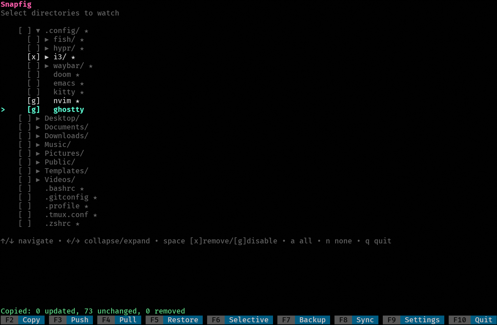

# Snapfig

Backup and restore your dotfiles straight from their original locations.

<p align="center">
  
</p>

> **Note:** This is the current version of Snapfig. The [original version](https://github.com/adrianpk/snapfig-deprecated) relied on a local webserver and browser-based interface. This version uses [Bubble Tea](https://github.com/charmbracelet/bubbletea) and runs directly in the console.

---

## What it does

Snapfig copies your configuration files to a local vault (`~/.snapfig/vault/`) that's automatically versioned with git. Unlike tools that use symlinks, you keep working with your files in their original locations. Snapfig mirrors them when you ask.

## Install

```bash
go install github.com/adrianpk/snapfig@latest
```

Or build from source:

```bash
git clone https://github.com/adrianpk/snapfig
cd snapfig
go build -o snapfig .
```

## Quick start

```bash
snapfig
```

1. Navigate with arrow keys or `j/k`
2. `Space` to select paths (cycles through modes)
3. `F9` to configure your remote repository
4. `F7` to backup (copy + push)

## TUI Controls

| Key | Action |
|-----|--------|
| `Space` | Cycle selection: `[ ]` → `[x]` → `[g]` → `[ ]` |
| `F2` | Copy to vault |
| `F3` | Push to remote |
| `F4` | Pull from remote (clones if vault doesn't exist) |
| `F5` | Restore from vault |
| `F6` | **Selective restore** (choose specific files to restore) |
| `F7` | **Backup** (Copy + Push in one step) |
| `F8` | **Sync** (Pull + Restore in one step) |
| `F9` | Settings (remote URL, background runner intervals) |
| `F10` | Quit |

### Selection modes

- `[ ]` = Not selected
- `[x]` = Selected, remove `.git` directories in backup
- `[g]` = Selected, preserve `.git` as `.git_disabled` (keeps history)

## Typical workflows

### On your main machine

1. `snapfig`
2. Select your config directories
3. `F9` → enter your git remote URL
4. `F7` → backs up and pushes

### On a new machine

1. Copy your `~/.config/snapfig/config.yml` (or just set the remote via F9)
2. `snapfig`
3. `F8` → clones vault and restores everything

### Regular backups

Just press `F7`. It copies changes and pushes to remote.

## CLI Commands

```bash
snapfig                 # Interactive interface (default)
snapfig copy            # Copy to vault
snapfig push            # Push to remote
snapfig pull            # Pull from remote (clones if needed)
snapfig restore         # Restore from vault
snapfig daemon start    # Start background runner
snapfig daemon stop     # Stop background runner
snapfig daemon status   # Show background runner status
snapfig setup           # Fire-and-forget setup (see below)
```

## Fire-and-Forget Setup

For automation scripts or quick setup without using the TUI:

```bash
snapfig setup \
  --paths=".config/nvim:g,.config/i3:x,.zshrc:x" \
  --remote="git@github.com:user/vault.git" \
  --copy-interval="1h" \
  --push-interval="24h"
```

This command:
1. Creates `~/.config/snapfig/config.yml` with the specified settings
2. Runs an initial copy to vault
3. Configures the git remote
4. Starts the daemon

### Path format

Paths use the format `path:mode` where mode is:
- `x` = remove `.git` directories (default if omitted)
- `g` = preserve `.git` as `.git_disabled`

### Available flags

| Flag | Description | Default |
|------|-------------|---------|
| `--paths` | Paths to watch (required) | - |
| `--remote` | Git remote URL | - |
| `--copy-interval` | Copy interval | `1h` |
| `--push-interval` | Push interval | `24h` |
| `--pull-interval` | Pull interval | disabled |
| `--auto-restore` | Auto restore after pull | `false` |
| `--no-daemon` | Don't start daemon | `false` |
| `--force` | Overwrite existing config | `false` |

After setup completes, instructions for daemon persistence (shell rc or systemd) are printed.

## How it handles git

Many config directories (nvim, doom emacs, etc.) are git repos themselves. Snapfig handles this:

- **remove** (`[x]`): Deletes `.git` in the vault copy. Clean backup, no nested repos.
- **disable** (`[g]`): Renames `.git` to `.git_disabled`. On restore, reverts back to `.git`.

Original directories are never modified.

## Background Runner

The daemon runs scheduled backups in the background without manual intervention.

### Commands

```bash
snapfig daemon start    # Start daemon
snapfig daemon status   # Check if running and show config
snapfig daemon stop     # Stop daemon
```

### Configuration

Configure via **Settings (F9)** in the TUI, or edit `~/.config/snapfig/config.yml` directly:

```yaml
daemon:
  copy_interval: 1h      # How often to copy to vault
  push_interval: 24h     # How often to push to remote
  pull_interval: ""      # How often to pull from remote (empty = disabled)
  auto_restore: false    # Automatically restore after pull
```

### Parameters

| Parameter | Description | Example |
|-----------|-------------|---------|
| `copy_interval` | Runs smart copy at this interval. Only changed files are copied. | `30m`, `1h`, `2h` |
| `push_interval` | Pushes vault to remote at this interval. Requires `remote` to be configured. | `12h`, `24h` |
| `pull_interval` | Pulls from remote at this interval. **Disabled by default** - enable with caution on multi-machine setups. | `24h` |
| `auto_restore` | When `true`, automatically restores files after a pull. **Use carefully** - could overwrite local changes. | `true`, `false` |

Intervals use Go duration format: `s` (seconds), `m` (minutes), `h` (hours). Examples: `30s`, `15m`, `1h`, `24h`.

### Logs

Activity is logged to `~/.snapfig/daemon.log`:

```bash
tail -f ~/.snapfig/daemon.log
```

Example output:
```
[snapfig] 2025/12/03 11:33:40 Copy started
[snapfig] 2025/12/03 11:33:40 Copy done: 1 paths, 2 updated, 3 unchanged, 0 removed
[snapfig] 2025/12/03 11:33:40   copied: .config/nvim
```

## Files

```
~/.config/snapfig/
└── config.yml          # Configuration (paths to watch, remote URL, daemon settings)

~/.snapfig/
├── vault/              # Your backed up files (git repo)
├── manifest.md         # Summary of what's backed up
├── daemon.pid          # PID file when daemon is running
└── daemon.log          # Daemon activity log
```

## Config format

```yaml
git: disable
remote: git@github.com:user/dotfiles.git

watching:
  - path: .config/nvim
    git: disable
    enabled: true
  - path: .zshrc
    git: remove
    enabled: true

daemon:
  copy_interval: 1h
  push_interval: 24h
```

Paths are relative to home directory. See [Background Runner](#background-runner) for all daemon options.

## Planned Improvements

- ~~Smart copy: copy only updated files within directories instead of replicating entire directory structures.~~
- ~~Selective restore: Allow restoring only specific dotfiles instead of restoring everything.~~
- ~~Background runner for periodic snapshots.~~
- ~~Implement fire-and-forget setup command for automated config and start.~~
- Alternative vault location: allow configuring a custom vault path (e.g. external drive, network share) for additional redundancy or local-only backups.
- Improve and polish the interface.
- Token-based authentication for git cloud services.
- Add automated tests.

## License

MIT
